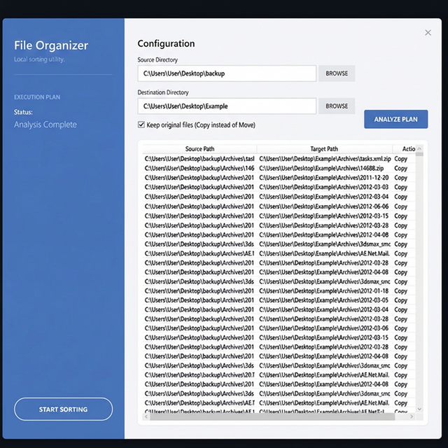

# FileOrganizer

A simple, fast, and strict C# Windows Desktop utility for automatically organizing local folders.

## Screenshots

*(Take screenshots of the app and save them in the `docs` folder to have them appear here!)*




## Overview

Built with Windows Presentation Foundation (WPF) with Test-Driven Development (TDD), the FileOrganizer utility analyzes a source directory and intelligently maps its contents to sub-folders based on extension categories.

It handles complex routing:

- **Pictures** (`.jpg`, `.png`, etc.) *— Automatically sub-sorted by **Camera Make/Model** using EXIF data.*
- **Movies** (`.mp4`, `.mkv`, etc.)
- **Audio** (`.mp3`, `.wav`, etc.) *— Automatically sub-sorted by **Artist** using ID3 tags.*
- **Documents** (`.doc`, `.pdf`*, etc.)
- **Archives** (`.zip`, `.rar`, etc.)
- **Executables** (`.exe`, `.msi`, etc.)
- **Books** (ePub, Mobi, and any >30 page PDFs)
- **Other** (Catch-all)

*Note: PDFs are analyzed using the PdfSharp library. Any PDF under 30 pages goes to the `PDFs` folder, any PDF over 30 pages goes to `Books`. Corrupted PDFs default defensively back to `PDFs`.*

The Organizer features two explicit phases to maintain data safety:

1. **Analyze (Generate Plan)**: Dry-runs the transfer mapping entirely in-memory allowing users to review actions prior to making any filesystem operations. It smartly handles file collisions indicating if an overwrite or skip is required.
2. **Execute Plan**: Physically performs the `Move`, `Copy`, or `Overwrite` operations asynchronously displaying progression via a simple progress bar.

---

## Getting Started

### Prerequisites

- Windows OS (WPF constraint)
- [.NET 10.0 SDK](https://dotnet.microsoft.com/download/dotnet/10.0) or newer installed on your machine.

### Building

To build the application using the cross-platform CLI:

1. Open a terminal (PowerShell, CMD, or bash).
2. Clone this repository and navigate to the root folder:

   ```bash
   git clone git@github.com:gonzoga/FileOrganizer.git
   cd FileOrganizer
   ```

3. Run the `.NET build` command:

   ```bash
   dotnet build
   ```

### Running the App

To launch the File Organizer UI directly from the command line:

```bash
cd FileOrganizer
dotnet run
```

Alternatively, you can open `FileOrganizer.slnx` (or `.sln`) in Visual Studio 2022+ and press `F5` to build and run the application.

### Running Unit Tests

This application was developed firmly with TDD. There are 50 comprehensive unit tests covering the Routing, PDF Heuristics, Collision, and Execution logic.

Run the test suite using:

```bash
dotnet test
```

## Usage

1. Click **Select Source Folder** to pick the chaotic folder containing your files.
2. Click **Select Destination Folder** to select where you would like the organized output (e.g., `Documents`, `Pictures` sub-folders) to easily route to.
3. Check the **"Copy Files (Leave Originals)"** box if you wish to construct a duplicate, ordered catalog without altering the original source files.
4. Click **Analyze (Generate Plan)**. Wait for the progress bar to complete. Use the DataGrid table to review every planned internal move safely.
5. Click **Execute Plan** once satisfied with the dry run to apply the changes!
